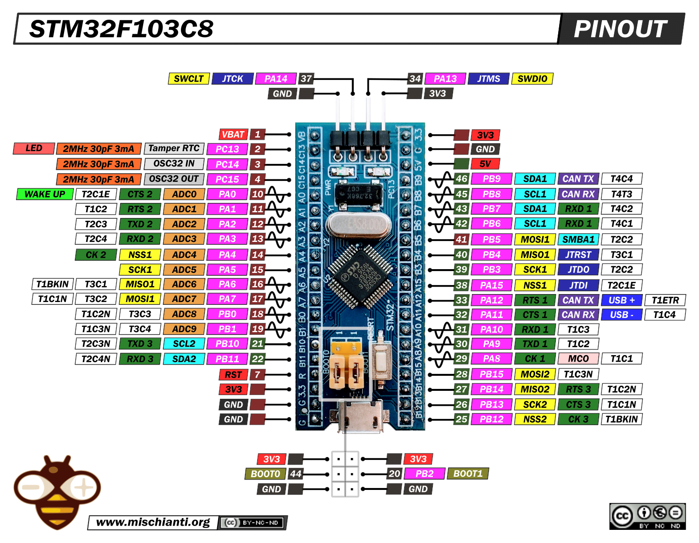

# Learning Rust on STM32F103C8T6

My personal walk through learning Rust development on STM32F103C8T6 microcontroller

- I'm using [cargo-flash](https://crates.io/crates/cargo-flash) to flash the board via an ST-Link V2 device.

  
Pinout Diagram

